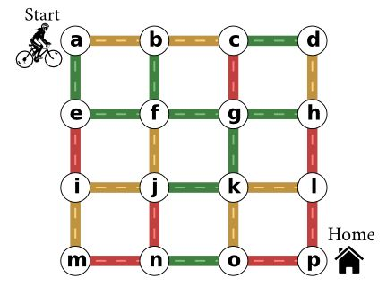

vmfactory
==============

.. Commented raw:: html

    <a href="https://twitter.com/share" class="twitter-share-button"
    data-text="MoviePy, script-based video editing" data-size="large" data-hashtags="MoviePy">Tweet
    </a>
    
    
    <iframe src="http://ghbtns.com/github-btn.html?user=Zulko&repo=vmfactory&type=watch&count=true&size=large"
    allowtransparency="true" frameborder="0" scrolling="0" width="152px" height="30px"></iframe>

Welcome ! The Viennese Maze factory (``vmfactory``) is a Python package for the automatic generation of *Viennese mazes*, which are labyrinths made of streets and traffic lights, like this one:

The map indicates the initial colors of the traffic lights in the different streets. Each time you pass a light, all green lights become orange, all orange lights become red, and all red lights become green. You cannot pass red lights and, since your breaks have failed, you cannot stop at a light or pass the same light twice in a row. Will you find your way home ?

 Here are `some more mazes <https://i.imgur.com/j2gWurM.jpg>`_ with different shapes, and `their solutions <https://i.imgur.com/bReTSfN.png>`_ .

User's Guide
--------------

.. toctree::
   :maxdepth: 1

   installation
   getting_started
   examples_scripts
   reference_manual
   
Contribute !
-------------

``vmfactory`` is an open source software written originally by Zulko and released under the MIT licence.
Everyone is very welcome to help improve the project, fork it, etc.

Since I didn't find anything similar elsewhere, I assume that Viennese mazes are something new (like, the new Sudoku, the main difference being maybe the popularity). I don't claim any copyright over the concept (is that even possible ?), but If you make Viennese mazes with this module and you were to refer to these as *Zulko's Viennese mazes*, my ego would be very grateful.

.. # THE NEXT LINES ADD A GITHUB RIBBON TO YOUR DOCUMENTATION.
.. # IT IS ONLY USEFUL IF YOUR PACKAGE IS ON GITHUB

.. raw:: html

        

